- [Структура проекта](#структура-проекта)
- [Обработка и очистка данных](#обработка-и-очистка-данных)
    - [Yandex Cloud | Airflow \& Spark-cluster \& S3](#yandex-cloud--airflow--spark-cluster--s3)
- [Моделирование и обучение](#моделирование-и-обучение)
    - [Localhost | MLFlow \& MinIO \& Airflow ( ~Prefect )](#localhost--mlflow--minio--airflow--prefect-)
      - [Image](#image)
    - [Валидация (A/B)](#валидация-ab)
      - [Image](#image-1)
- [Доступ к модели](#доступ-к-модели)
  - [Localhost | FastAPI \& Docker](#localhost--fastapi--docker)
  - [Localhost | Push Docker Hub](#localhost--push-docker-hub)
- [Деплой | Kubernetes](#деплой--kubernetes)
  - [Yandex Cloud Kubernetes Cluster](#yandex-cloud-kubernetes-cluster)
  - [Yandex Cloud | Разворот сервисов в k8s](#yandex-cloud--разворот-сервисов-в-k8s)
- [Мониторинг](#мониторинг)
  - [Localhost Minikube | Prometheus \& Grafana](#localhost-minikube--prometheus--grafana)
- [Потоковая обработка](#потоковая-обработка)
  - [Localhost | Kafka](#localhost--kafka)
- [Алертинг](#алертинг)
  - [img](#img)
- [URLs](#urls)


# Структура проекта
```
A2K-PROCAR/
├───.github/                 # CI/CD пайплайны
├───dags/                    # DAGs для Airflow
├───data/                    # Данные для проекта
├───docs/                    # Архитектура проекта
├───infra/                   # Инфраструктура в YC Cloud для очистки данных
├───infra-local/             # Инфраструктура в YC Cloud и Local для проекта
│   ├───a2k-docker-rest/     # Манифесты Kubernetes и Docker-compose
│   ├───airflow-local/       # Docker-compose для Airflow
│   ├───grafana/             # Docker-compose для Grafana
│   ├───kafka/               # Docker-compose для Kafka
│   ├───minikube/            # Deploy Local Kubernetes
│   └───mlflow/              # Docker-compose для MLflow & Minio
├───infra-yc-k8s-zona/       # Deploy Yandex Cloud Kubernetes
├───notebooks/               # Jupyter notebooks
├───requirements/            # Python зависимости
└───src/                     # Python-скрипты (train*, preprocess* и т.д.)
```

# Полный ЖЦ ML-модели

0. см. раздел "Предварительная настройка окружения"
    + venv
1. Подготовка инфраструктуры
    + Docker
    + Minikube
    - DVC
    + Feast (см. раздел Feast)
    + MLFlow & MinIO
      + (a2k-procar) user@host:~/myfolder/kp_a2k/a2k-procar$ cd infra-local/mlflow/
      + (a2k-procar) user@host:~/myfolder/kp_a2k/a2k-procar/infra-local/mlflow$ docker-compose up -d --build
    + Airflow
      + (a2k-procar) notai@notaihost:~/otus/kp_a2k/a2k-procar/infra-local/airflow-local/airflow$ make start
      + /home/notai/otus/kp_a2k/a2k-procar/infra-local/airflow-local/airflow/config/airflow.cfg > refresh_interval = 300 > 30
    - Redis (Online Feature Store)
    - Kafka
    - Prometheus
    - Grafana
2. Обработка и очистка данных. Инжиниринг данных и векторизация признаков (Data & Feature Engineering)
    - Data Versioning (DVC). Нужно версионировать данные, на которых училась модель, иначе эксперименты невоспроизводимы.
    - Feast (Offline): Сохранение вычисленных признаков в MinIO через Feast.
    + (.venv) notai@notaihost:~/Sandbox/a2k-procar/src$ python3 test_preprocessing_local.py
3. Моделирование и обучение. Обучение и эксперименты (Training & Experimentation)
    - Скрипт дергает historical features из Feast.
    + Логирование метрик, параметров и самой модели в MLFlow.
    + (a2k-procar) user@host:~/myfolder/kp_a2k/a2k-procar/infra-local/mlflow$ cd ../../src/
    + (a2k-procar) user@host:~/myfolder/kp_a2k/a2k-procar/src$ python model_train_procar.py --n-estimators 50 --max-depth 7
4. Валидация и регистрация модели (Validation & Registry).
    - Offline-валидация (проверка метрик на hold-out выборке).
    - Model Validation (Great Expectations или кастомные тесты). Проверка модели на адекватность (например, метрикаAccuracy > 0.8), чтобы в прод не ушла сломанная модель.
    - Model Signing / Scanning. Проверка модели на наличие backdoor'ов (например, с помощью art — Adversarial Robustness Toolbox) перед тем, как подписать её и положить в Registry.
    - Переход модели в статус Production в MLFlow
    - /home/notai/otus/kp_a2k/a2k-procar/infra-local/airflow-local/src/a2k-procar-dag.py
5. Оркестрация (Airflow DAGs)
    - DAG должен выглядеть так: Скачать данные -> Очистить -> Обновить Feast Offline -> Обучить модель -> Провалидировать -> Зарегистрировать в MLFlow -> (опционально) задеплоить
    + /home/notai/Sandbox/a2k-procar/infra-local/airflow-local/src/a2k-procar-dag.py
6. Доступ к модели. Развертывание (CI/CD & Deployment)
    - FastAPI + Docker
    - CI/CD Pipeline (GitLab CI / GitHub Actions). По коммиту или по успеху Airflow-джобы должен собираться Docker-образ с новой моделью (pulled из MLFlow) и деплоиться в Minikube (через Helm)
    - см. раздел "Доступ к модели"
7. Online-инференс (Serving). Потоковая обработка
    - FastAPI поднимается в Minikube.
    - Feast (Online): При получении REST/gRPC запроса FastAPI идет в Redis за фичами.
    - Kafka здесь выступает как источник событий: новые данные прилетают в Kafka -> скрипт обновляет Online Store в Feast -> модель может делать предсказания в реальном времени.
    - см. раздел "Потоковая обработка"
8. Инференс и A/B тестирование (В проде)
    - Запуск двух версий FastAPI сервисов (например, v1 и v2) в Minikube. Istio или простой NGINX ингресс раскидывает трафик 50/50. Сбор логов предсказаний
9. Мониторинг (System + ML Monitoring)
    - Infrastructure Monitoring: Prometheus + Grafana следят за CPU/RAM/Latency FastAPI
    - ML Monitoring (Data & Concept Drift). Например использовать инструменты типа Evidently AI или WhyLabs. Они смотрят: "Та ли статистика у признаков сейчас (в проде), какой была при обучении?". Если нет — это Data Drift.
    - см. раздел "Мониторинг"
10. Алертинг и триггер ретрейна (Feedback Loop)
    - Алерты в Grafana (или PagerDuty/Telegram) на статус сервисов, Data Drift > 10%
    - Continuous Training (CT). Сигнал о дрифте из Grafana/Kafka должен триггерить новый запуск Airflow DAG (возвращаемся на Этап 5), чтобы переобучить модель на свежих данных.
    - см. раздел "Алертинг"

# Предварительная настройка окружения

```bash
python3 -m venv .venv
source .venv/bin/activate

# проверить, все ли пакеты нужны в requirements.txt
pip install -r requirements.txt # pip install --no-cache-dir -r requirements.txt
```

# Sorce | Links
Забрать схему mlprocess из 
- https://habr.com/ru/companies/ruvds/articles/990814/
- https://habr.com/ru/companies/itsumma/articles/782020/

# Обработка и очистка данных 

### Локальный запуск
```bash
(.venv) notai@notaihost:~/Sandbox/a2k-procar/src$ python3 test_preprocessing_local.py
```
### Feast

```bash
устанавливаем зависимости pip install -r requirements/requirements-feast.txt
ставим sqllite sudo apt-get install sqlite3
запускаем feast apply (make apply)
копируем путь до online_store.db
подключаемся к БД (через Database Client) SQLLite
запускаем feast ui (make ui)
```

### Запуск в облаке | Yandex Cloud | Airflow & Spark-cluster & S3  

**Используемый каталог**
```
.\a2k-procar\infra
```

### Yandex Cloud | Airflow & Spark-cluster & S3  
```bash
# Terraform Infrastructure with modules for Yandex.Cloud
# This repository contains the Terraform code to create the infrastructure for the project. The infrastructure is divided into modules to make it more modular and reusable.

(a2k-procar) user@host:~/myfolder/kp_a2k/a2k-procar/infra$ make apply
```
Загрузка переменных


Использования разработанного скрипта data_preprocessing_procar.py в даге


Успешное выполнение пайплайна


Результат выполнения пайплайна. Создана структура в бакете


Успешное выполнение data_preprocessing_procar.py из дага


# Моделирование и обучение

### Localhost | MLFlow & MinIO & Airflow ( ~Prefect )

Запуск / останов MLFlow & MinIO
```bash
(a2k-procar) user@host:~/myfolder/kp_a2k/a2k-procar$ cd infra-local/mlflow/
(a2k-procar) user@host:~/myfolder/kp_a2k/a2k-procar/infra-local/mlflow$ docker-compose up -d --build

(a2k-procar) user@host:~/myfolder/kp_a2k/a2k-procar/src$ cd ../infra-local/mlflow/
(a2k-procar) user@host:~/myfolder/kp_a2k/a2k-procar/infra-local/mlflow$ docker-compose down

# test train
(a2k-procar) user@host:~/myfolder/kp_a2k/a2k-procar/infra-local/mlflow$ cd ../../src/
(a2k-procar) user@host:~/myfolder/kp_a2k/a2k-procar/src$ python model_train_procar.py --n-estimators 50 --max-depth 7
python3 model_train_procar.py --model-name url_classifier
python model_train_procar.py --n-estimators 200 --max-depth 15

```

Запуск / конфигурация / останов Airflow
```bash
(a2k-procar) notai@notaihost:~/otus/kp_a2k/a2k-procar/infra-local/airflow-local/airflow$ make start

# edit config
/home/notai/otus/kp_a2k/a2k-procar/infra-local/airflow-local/airflow/config/airflow.cfg > refresh_interval = 300 > 30

# for yc
Создание AWS_ACCESS_KEY (S3) > yc > service acc > create new key

#local test
(a2k-procar) notai@notaihost:~/otus/kp_a2k/a2k-procar/infra-local/airflow-local/airflow$ python ../src/etl.py
(a2k-procar) notai@notaihost:~/otus/kp_a2k/a2k-procar/infra-local/airflow-local/airflow$ cp ../src/etl_dag.py dags/


(a2k-procar) notai@notaihost:~/otus/kp_a2k/a2k-procar/infra-local/airflow-local/airflow$ make stop
```

Запуск / останов Prefect (не актуально)
```bash
#### (a2k-procar) notai@notaihost:~/otus/kp_a2k/a2k-procar/infra-local/mlflow$ docker-compose up -d --build
(a2k-procar) notai@notaihost:~/otus/kp_a2k/a2k-procar/infra-local/prefect$ prefect server start
(a2k-procar) notai@notaihost:~/otus/kp_a2k/a2k-procar/infra-local/prefect$ prefect agent start -q default

#### cd prefect_flows
#### 
#### (a2k-procar) notai@notaihost:~/otus/kp_a2k/a2k-procar/infra-local/mlflow/prefect_flows$ prefect config set PREFECT_API_URL="http://127.0.0.1:4200/api"
#### (a2k-procar) notai@notaihost:~/otus/kp_a2k/a2k-procar/infra-local/mlflow/prefect_flows$ prefect config view | grep PREFECT_API_URL
#### # PREFECT_API_URL='http://127.0.0.1:4200/api' (from profile)


##### "prefect==2.20.18",
##### "pydantic-settings==2.2.1",
##### "uv==0.9.2",
##### 
##### 
##### добавил версию этого скрипта, которая автоматически выполняет prefect 
##### deployment build и prefect deployment apply, чтобы всё делалось одним запуском (без ручных CLI команд)

(a2k-procar) notai@notaihost:~/otus/kp_a2k/a2k-procar/infra-local/prefect$ python setup_prefect_blocks.py
(a2k-procar) notai@notaihost:~/otus/kp_a2k/a2k-procar/infra-local/prefect$ prefect block ls
(a2k-procar) notai@notaihost:~/otus/kp_a2k/a2k-procar/infra-local/prefect$ prefect deployment build train_pipeline_prefect.py:train_pipeline \
  -n "train-car-price" \
  -q "default" \
  -sb local-file-system/local-storage \
  -ib process/local-process

prefect deployment build example_flow.py:hello_flow \
  -n "hello-flow" \
  -q "default" \
  -sb local-file-system/local-storage \
  -ib process/local-process


# Регистрация Flow в Prefect
(a2k-procar) notai@notaihost:~/otus/kp_a2k/a2k-procar/infra-local/prefect$ prefect deployment apply train_pipeline-deployment.yaml
```

#### Image

Docker-compose
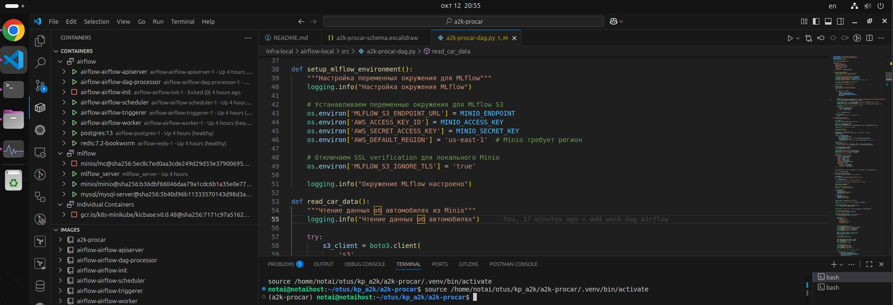

Airflow. Чтение данных
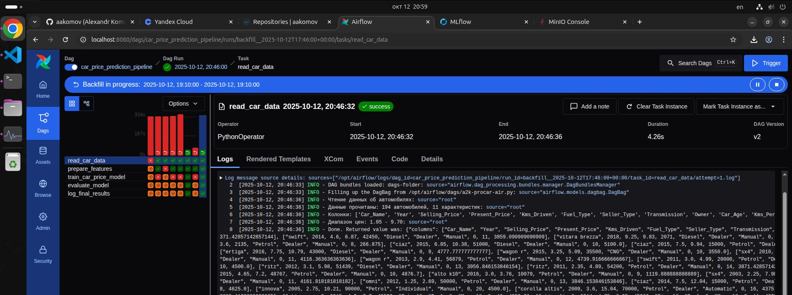

Airflow. Подготовка фичей
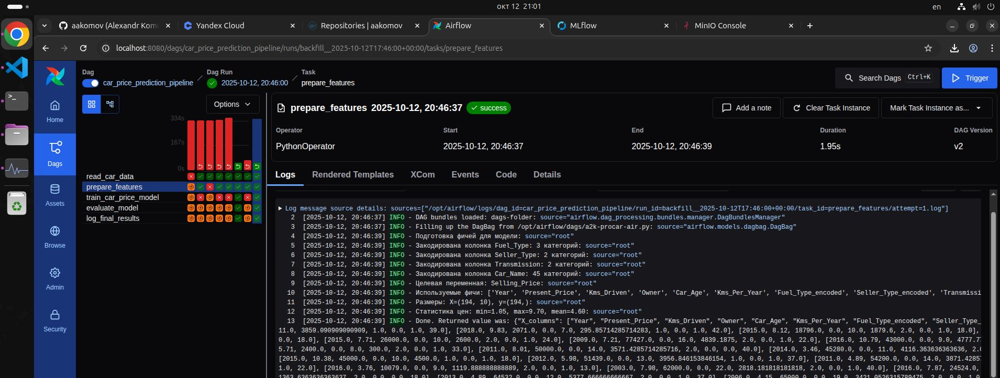

Airflow. Обучение
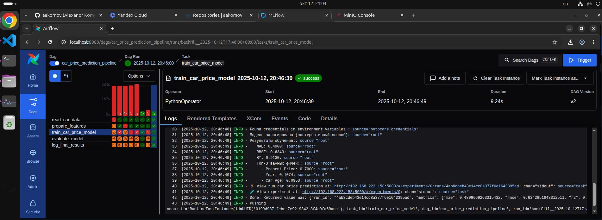

Airflow. Оценка
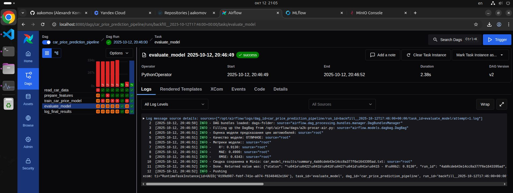

Airflow. Регистрация в MLflow
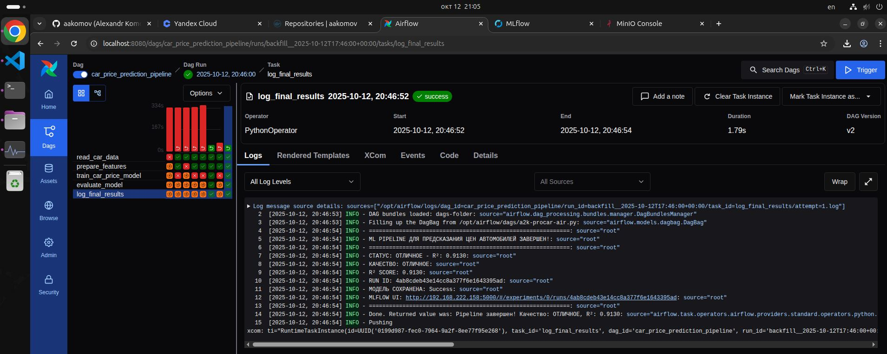

MLflow. Эксперименты
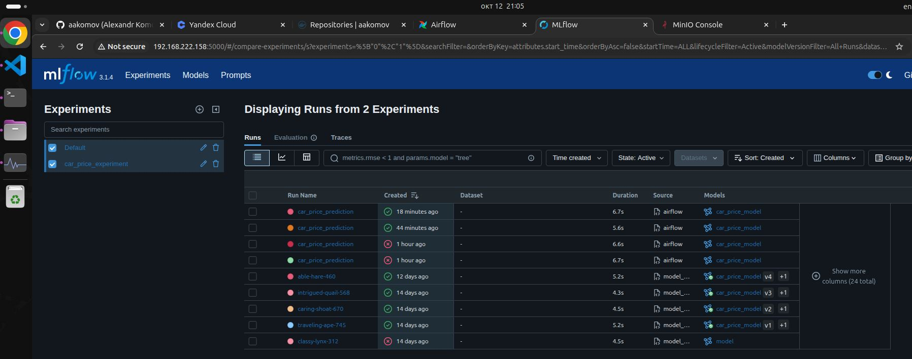

MLflow. Сравнение запусков
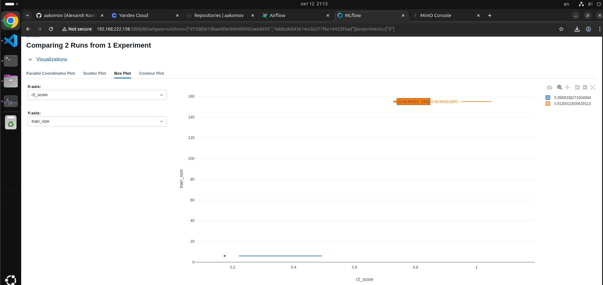

MLflow. Информация об эксперименте
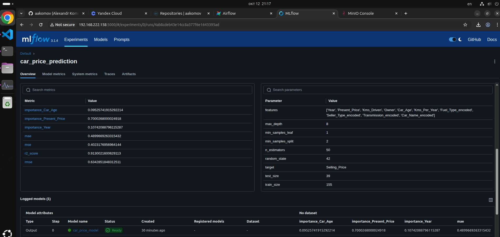

MLflow. Артифакты
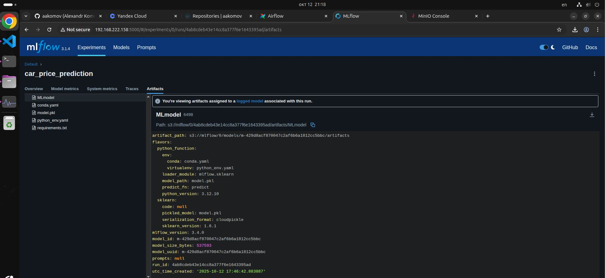

Minio. Ссылка на артифакты
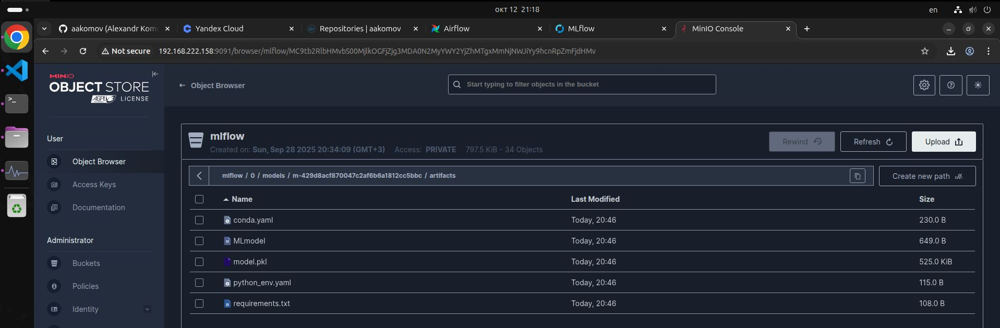

Minio. Итоговые результаты
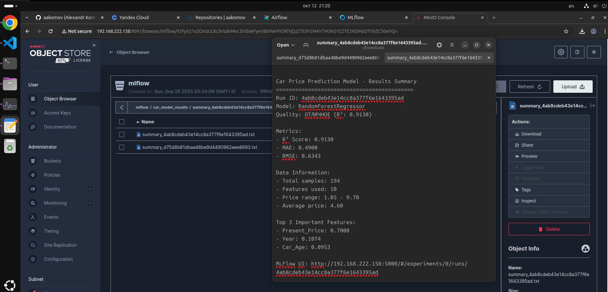

### Валидация (A/B)
Добавлен этап валидации в скрипт
/home/notai/otus/kp_a2k/a2k-procar/infra-local/airflow-local/src/a2k-procar-dag.py

#### Image

Добавление в пайплайн этапа валидации
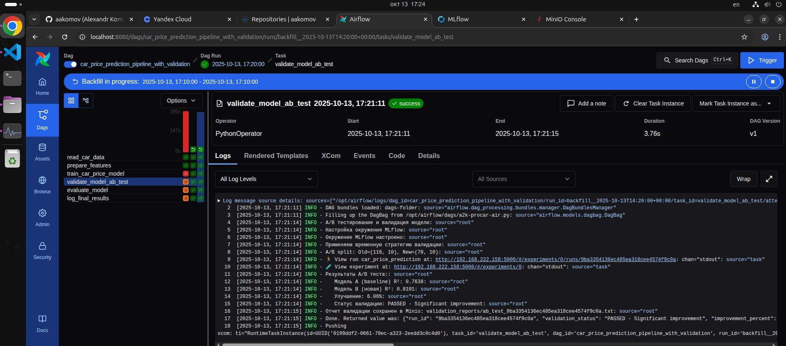

Регистрация в MLflow результатов валидации
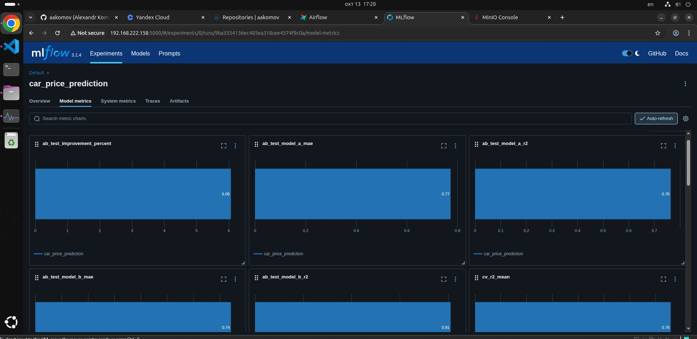

Регистрация в Minio результатов валидации
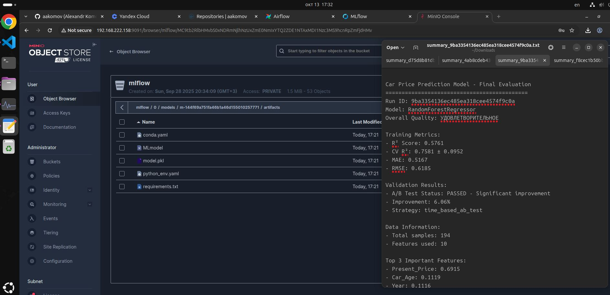


# Доступ к модели

## Localhost | FastAPI & Docker 

```bash
(a2k-procar) user@host:~/myfolder/kp_a2k/a2k-procar$ cd infra-local/a2k-docker-rest/
export PYTHONPATH=$(pwd)
(a2k-procar) user@host:~/myfolder/kp_a2k/a2k-procar$ python3 src/pipeline.py
(a2k-procar) user@host:~/myfolder/kp_a2k/a2k-procar$ uvicorn src.app:app --port 8000 --reload
```

```bash
(a2k-procar) user@host:~/myfolder/kp_a2k/a2k-procar/infra-local/a2k-docker-rest$ make build-prod
(a2k-procar) user@host:~/myfolder/kp_a2k/a2k-procar/infra-local/a2k-docker-rest$ make run-prod
```

## Localhost | Push Docker Hub
```bash
(a2k-procar) user@host:~/myfolder/kp_a2k/a2k-procar/infra-local/a2k-docker-rest$ docker login -u aakomov
(a2k-procar) user@host:~/myfolder/kp_a2k/a2k-procar/infra-local/a2k-docker-rest$ docker tag a2k-procar:prod aakomov/a2k-procar:prod
(a2k-procar) user@host:~/myfolder/kp_a2k/a2k-procar/infra-local/a2k-docker-rest$ docker push aakomov/a2k-procar:prod
```
Развертывание


Проверка доступности сервиса


POST запрос из Postman


Push Docker Hub


# Деплой | Kubernetes


## Yandex Cloud Kubernetes Cluster

**Используемый каталог**
```
.\a2k-procar\infra-yc-k8s-zona
```

Инфраструктурный код на Terraform для развертывания управляемого Kubernetes кластера в Yandex Cloud.

**`### Описание`**

Terraform модули:

- Managed Kubernetes кластер с одним мастер-узлом
- Группа узлов с preemptible инстансами (прерываемые виртуальные машины)
- Сетевая инфраструктура (VPC, подсеть, группы безопасности)
- Сервисный аккаунт с необходимыми правами
- KMS ключ для шифрования данных кластера

**`### Требования`**

- Terraform >= 1.0.0
- Yandex Cloud CLI
- Аккаунт в Yandex Cloud с активированным платежным аккаунтом

**`### Быстрый старт`**

1. Клонирование репозитория:
```bash
git clone https://github.com/aakomov/a2k-procar
cd .\a2k-procar\infra-yc-k8s-zona
```

2. Создание файла с переменными `infra/terraform.tfvars`:
```hcl
config = {
  zone      = "ru-central1-b"
  token     = "your-oauth-token"
  cloud_id  = "your-cloud-id"
  folder_id = "your-folder-id"
}

cluster_name         = "k8s-cluster"
network_name         = "k8s-network"
subnet_name          = "k8s-subnet"
service_account_name = "k8s-service-account"
```

3. Инициализация Terraform и применение конфигурации:
```bash
cd infra
terraform init
terraform plan
terraform apply
```

**`### Структура`**

```
infra/
├── modules/
│   ├── iam/              # Модуль для создания сервисного аккаунта и ролей
│   ├── network/          # Модуль для создания сетевой инфраструктуры
│   └── k8s-cluster/      # Модуль для создания Kubernetes кластера
├── main.tf               # Основной файл конфигурации
├── variables.tf          # Определение переменных
├── outputs.tf            # Выходные значения
└── provider.tf           # Настройка провайдера
```

**`### Настройка после развертывания`**

После успешного применения конфигурации:

1. Получение конфигурации для kubectl:
```bash
yc managed-kubernetes cluster get-credentials --id <cluster-id> --external
```

2. Проверка подключения к кластеру:
```bash
kubectl cluster-info
kubectl get nodes
```

**`### Настройка доступа к кластеру`**

После успешного развертывания кластера необходимо настроить доступ через kubectl:

1. Установка утилиты Yandex Cloud CLI, если она еще не установлена:
```bash
curl -sSL https://storage.yandexcloud.net/yandexcloud-yc/install.sh | bash
```

2. Инициализация CLI и авторизация:
```bash
yc init
```

3. Получение конфигурации для доступа к кластеру:
```bash
yc managed-kubernetes cluster get-credentials --id $(terraform output -raw cluster_id) --external
```

4. Проверка подключения к кластеру:
```bash
kubectl cluster-info
kubectl get nodes
```

5. (Опционально) Использование отдельного контекста для кластера:
```bash
# Переименовать контекст
kubectl config rename-context yc-k8s-cluster my-cluster-name

# Установить контекст по умолчанию
kubectl config use-context my-cluster-name
```

6. Проверка текущей конфигурации:
```bash
kubectl config get-contexts
```

**`#### Устранение проблем с доступом`**

Если возникли проблемы с доступом к кластеру:

1. Проверка статуса кластера:
```bash
yc managed-kubernetes cluster list
```

2. Проверка что IP адрес имеет доступ к API серверу кластера:
```bash
curl -k https://$(terraform output -raw cluster_endpoint)
```

3. Проверка корректности kubeconfig:
```bash
kubectl config view
```

**`### Удаление ресурсов`**

Удаления всех созданных ресурсов:
```bash
terraform destroy
```

## Yandex Cloud | Разворот сервисов в k8s 

**Используемый каталог**
```
.\a2k-procar\infra-local
```

```bash
user@host:~$ sudo snap install kubectl --classic


# https://helm.sh/docs/intro/install/
(a2k-procar) user@host:~/myfolder/kp_a2k/a2k-procar$ curl -fsSL -o get_helm.sh https://raw.githubusercontent.com/helm/helm/main/scripts/get-helm-3
(a2k-procar) user@host:~/myfolder/kp_a2k/a2k-procar$ chmod 700 get_helm.sh
(a2k-procar) user@host:~/myfolder/kp_a2k/a2k-procar$ ./get_helm.sh


## DEPLOY
user@host:~$ yc managed-kubernetes cluster get-credentials --id catphenfv8qti7f2fmhi --external
#("важно знать в каком контексте находимся")
user@host:~$ export KUBE_CONFIG=~/.kube/config 

(a2k-procar) user@host:~/myfolder/kp_a2k/a2k-procar/infra-local/a2k-docker-rest$ kubectl get all
(a2k-procar) user@host:~/myfolder/kp_a2k/a2k-procar/infra-local/a2k-docker-rest$ make helm-deploy
(a2k-procar) user@host:~/myfolder/kp_a2k/a2k-procar/infra-local/a2k-docker-rest$ kubectl get all -n a2k-procar

### OR

(a2k-procar) user@host:~/myfolder/kp_a2k/a2k-procar/infra-local/a2k-docker-rest$ kubectl apply -f k8s/namespace.yaml
#namespace/a2k-procar created
(a2k-procar) user@host:~/myfolder/kp_a2k/a2k-procar/infra-local/a2k-docker-rest$ kubectl config set-context --current --namespace=a2k-procar
#Context "yc-k8s-cluster" modified.
(a2k-procar) user@host:~/myfolder/kp_a2k/a2k-procar/infra-local/a2k-docker-rest$ kubectl apply -f k8s/deployment.yaml
#deployment.apps/a2k-procar created
(a2k-procar) user@host:~/myfolder/kp_a2k/a2k-procar/infra-local/a2k-docker-rest$ kubectl apply -f k8s/service.yaml
#service/a2k-procar created
(a2k-procar) user@host:~/myfolder/kp_a2k/a2k-procar/infra-local/a2k-docker-rest$ kubectl apply -f k8s/ingress.yaml
#ingress.networking.k8s.io/a2k-procar created
(a2k-procar) user@host:~/myfolder/kp_a2k/a2k-procar/infra-local/a2k-docker-rest$ kubectl get pods
#NAME                          READY   STATUS    RESTARTS   AGE
#a2k-procar-7b5d6557bc-gjxgs   1/1     Running   0          51s

# INGRESS
(a2k-procar) user@host:~/myfolder/kp_a2k/a2k-procar/infra-local/a2k-docker-rest$ make helm-install-ingress
(a2k-procar) user@host:~/myfolder/kp_a2k/a2k-procar/infra-local/a2k-docker-rest$ kubectl get all -n ingress-nginx


## DELETE K8S
(a2k-procar) user@host:~/myfolder/kp_a2k/a2k-procar/infra-local/a2k-docker-rest$ make helm-destroy

### OR

(a2k-procar) user@host:~/myfolder/kp_a2k/a2k-procar/infra-local/a2k-docker-rest$ kubectl delete -f k8s/ingress.yaml
#ingress.networking.k8s.io "a2k-procar" deleted from a2k-procar namespace
(a2k-procar) user@host:~/myfolder/kp_a2k/a2k-procar/infra-local/a2k-docker-rest$ kubectl delete -f k8s/service.yaml
#service "a2k-procar" deleted from a2k-procar namespace
(a2k-procar) user@host:~/myfolder/kp_a2k/a2k-procar/infra-local/a2k-docker-rest$ kubectl delete -f k8s/deployment.yaml
#deployment.apps "a2k-procar" deleted from a2k-procar namespace
(a2k-procar) user@host:~/myfolder/kp_a2k/a2k-procar/infra-local/a2k-docker-rest$ kubectl delete -f k8s/namespace.yaml
#namespace "a2k-procar" deleted
```
Get Nodes
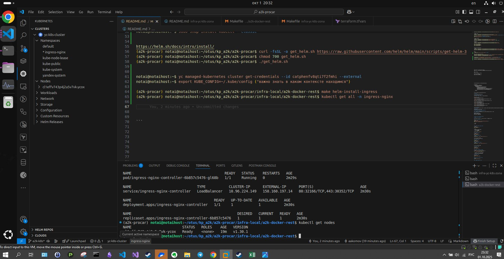

Вывод информации об INGRESS
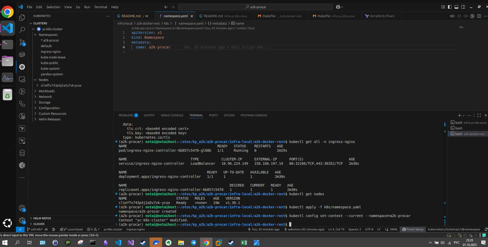

Get Pods
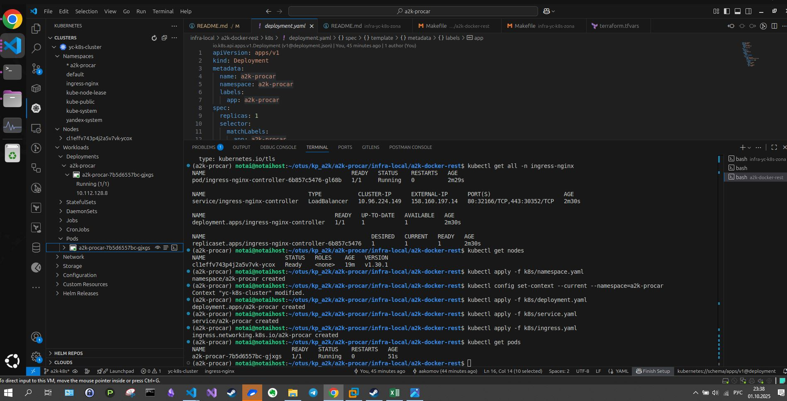

Вывод информации о поде
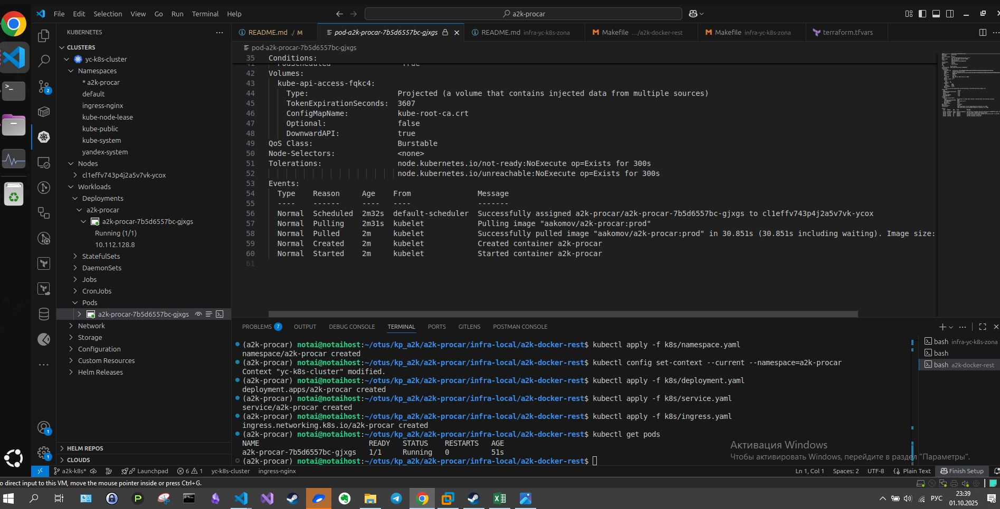

Вывод логов из пода
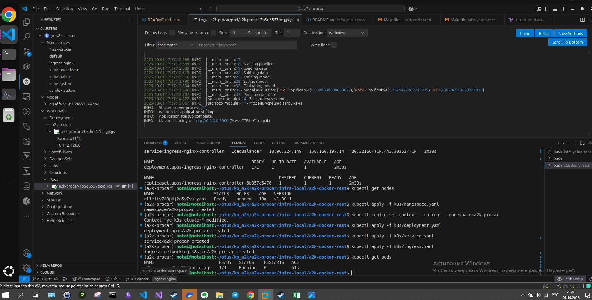

Статус сервиса

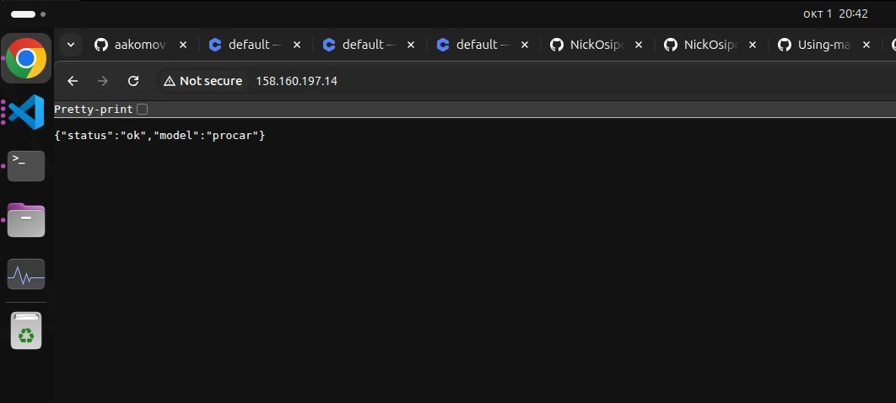

POST запрос к публичному сервису
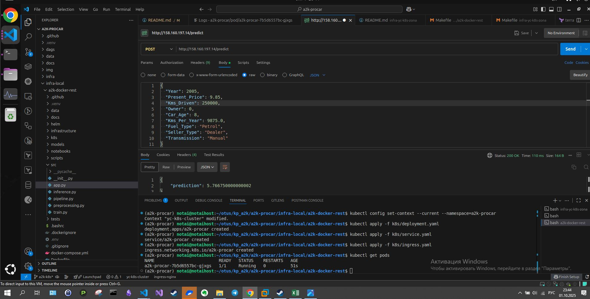

Разворот через helm-deploy
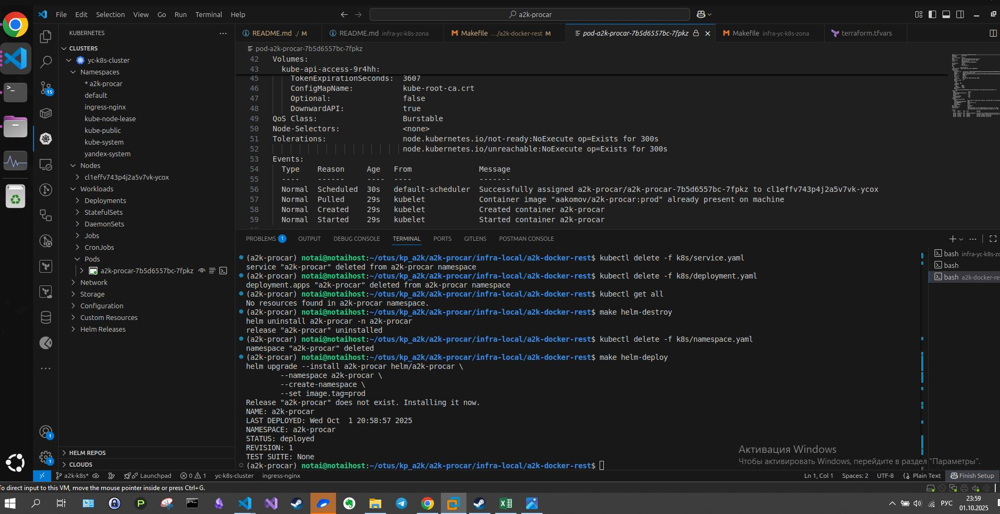


# Мониторинг 
## Localhost Minikube | Prometheus & Grafana

```bash

Перед этим запустить k8s
minikube start

helm list

(a2k-procar) notai@notaihost:~/otus/kp_a2k/a2k-procar/infra-local/a2k-docker-rest$ make helm-deploy

(otus-ml-skel) user@host:~/myfolder/39/otus-ml-skel/service$ 
helm repo add prometheus-community https://prometheus-community.github.io/helm-charts
helm repo update

# если две команды выше уже были выполнены, то можно просто выполнить эту:
helm upgrade --install monitoring prometheus-community/kube-prometheus-stack -n default
helm upgrade --install monitoring prometheus-community/kube-prometheus-stack -n a2k-procar

(otus-ml-skel) user@host:~/myfolder/39/otus-ml-skel/service$ kubectl --namespace default get secrets monitoring-grafana -o jsonpath="{.data.admin-password}" | base64 -d ; echo
(otus-ml-skel) user@host:~/myfolder/39/otus-ml-skel/service$ kubectl --namespace default get pods
(otus-ml-skel) user@host:~/myfolder/39/otus-ml-skel$ helm uninstall monitoring -n default


kubectl apply -f monitoring-a2k-procar.yml
(a2k-procar) notai@notaihost:~/otus/kp_a2k/a2k-procar/infra-local/a2k-docker-rest/k8s$ kubectl apply -f monitoring-a2k-procar.yaml
kubectl get servicemonitors -n monitoring
kubectl port-forward svc/monitoring-kube-prometheus-prometheus -n monitoring 9090:9090
kubectl port-forward svc/monitoring-kube-prometheus-prometheus -n a2k-procar 9090:9090
http://localhost:9090
kubectl port-forward svc/monitoring-grafana -n monitoring 3000:80
kubectl port-forward svc/monitoring-grafana -n a2k-procar 3000:80
http://localhost:3000

Войти (логин admin, пароль можно узнать:
kubectl get secret monitoring-grafana -n monitoring -o jsonpath="{.data.admin-password}" | base64 --decode)

curl -X POST "http://localhost:8000/predict" \
  -H "Content-Type: application/json" \
  -d '{"Year":2018,"Present_Price":9.85,"Kms_Driven":40000,"Owner":0,"Car_Age":5,"Kms_Per_Year":8000,"Fuel_Type":"Petrol","Seller_Type":"Dealer","Transmission":"Manual"}'


## debug
### kubectl get pods -n a2k-procar
### kubectl logs -n a2k-procar deployment/a2k-procar
### kubectl logs -n a2k-procar <pod_name>
### kubectl get svc -n a2k-procar

### kubectl exec -it -n a2k-procar $(kubectl get pod -n a2k-procar -l app=a2k-procar -o name | head -1) -- sh
### apt update && apt install -y curl
### curl -v 127.0.0.1:8000/metrics

### minikube ssh docker images | grep aakomov
### inikube ssh docker rmi aakomov/a2k-procar:prod


(a2k-procar) user@host:~/myfolder/kp_a2k/a2k-procar/infra-local/a2k-docker-rest$ kubectl apply -f k8s/namespace.yaml
(a2k-procar) user@host:~/myfolder/kp_a2k/a2k-procar/infra-local/a2k-docker-rest$ kubectl apply -f k8s/deployment.yaml
(a2k-procar) user@host:~/myfolder/kp_a2k/a2k-procar/infra-local/a2k-docker-rest$ kubectl apply -f k8s/service.yaml
(a2k-procar) user@host:~/myfolder/kp_a2k/a2k-procar/infra-local/a2k-docker-rest$ kubectl apply -f k8s/monitoring-a2k-procar.yaml

kubectl port-forward svc/a2k-procar -n a2k-procar 8000:80

(a2k-procar) user@host:~/myfolder/kp_a2k/a2k-procar/infra-local/a2k-docker-rest$ kubectl delete -f k8s/monitoring-a2k-procar.yaml
(a2k-procar) user@host:~/myfolder/kp_a2k/a2k-procar/infra-local/a2k-docker-rest$ helm uninstall monitoring -n a2k-procar
(a2k-procar) user@host:~/myfolder/kp_a2k/a2k-procar/infra-local/a2k-docker-rest$ make helm-destroy
```

Разворот мониторинга локально в minikube


Локальный Prometheus


Метрики в Prometheus


Загрузка дашборда procar-dashboard.json в Grafana 


Метрики в Grafana


# Потоковая обработка
## Localhost | Kafka

infra-local\kafka\docker-compose up


```
Разворот .\a2k-procar\infra-local\kafka\docker-compose.yml
```
Топики
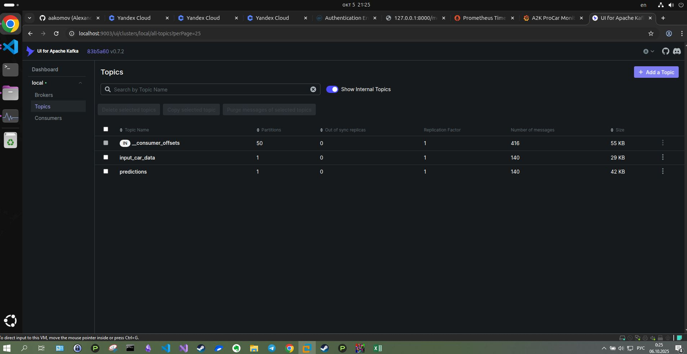

Результат работы Producer


Результат работы Consumer


Consumer


# Алертинг

Скрипты и изменеия внесены в рамках коммита "alerting".

## img

Срабатывание алерта в Grafana
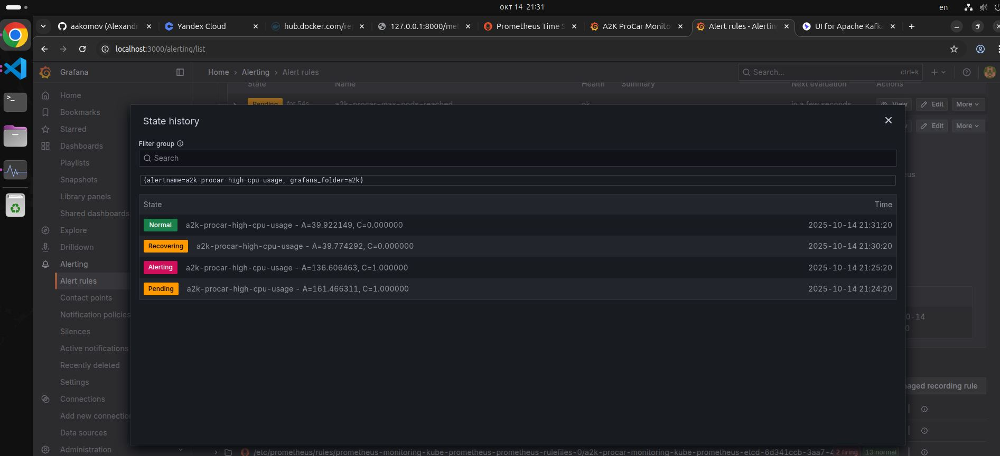

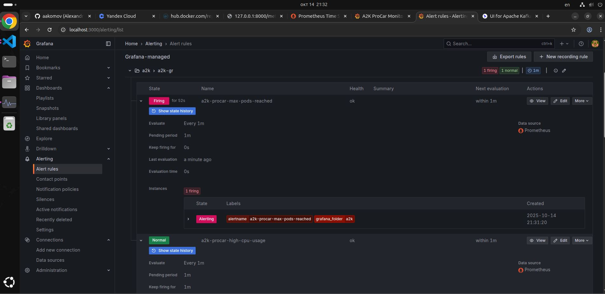

Мониторинг при нагрузке
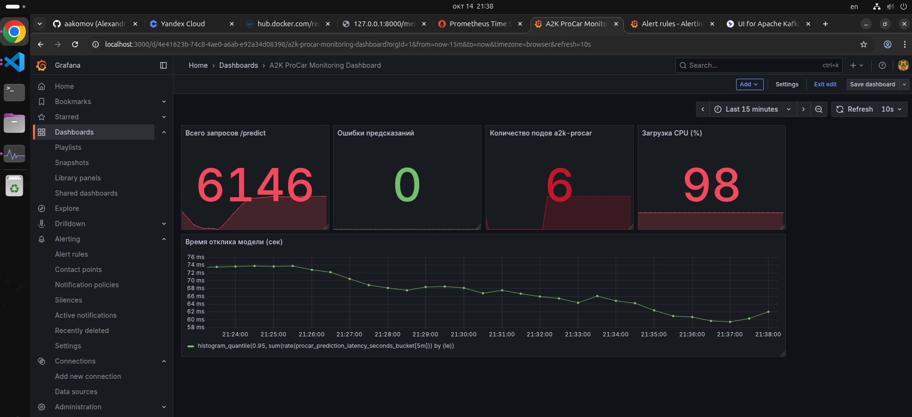

Информация об использовании кастомного endpoint
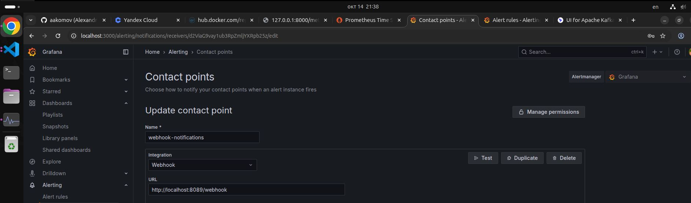

Очередь в Kafka
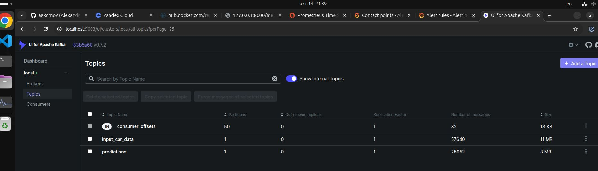

Поднятые поды при нагрузке
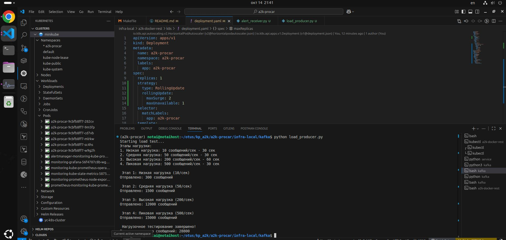


```bash

kubectl create ns monitoring

helm install kps prometheus-community/kube-prometheus-stack \
  --namespace monitoring \
  --set grafana.adminPassword='admin' \
  --set grafana.defaultDashboardsTimezone='browser' \
  --set prometheus.prometheusSpec.scrapeInterval='15s'

kubectl port-forward svc/kps-kube-prometheus-stack-prometheus -n monitoring 9090:9090
kubectl port-forward svc/kps-grafana -n monitoring 3000:80

eval $(minikube -p minikube docker-env)
docker build -t ml-infer:0.1 .

docker run --rm ml-infer:0.1

kubectl apply -f k8s/deployment.yaml
kubectl apply -f k8s/service.yaml
kubectl apply -f k8s/servicemonitor.yaml

kubectl rollout status deploy/ml-infer
kubectl get pods

kubectl port-forward svc/ml-infer 8080:8000

chmod +x load_test.sh
./load_test.sh 8080 200

helm uninstall kps -n monitoring

```


# URLs
```
http://localhost:8000/ (fastapi)
http://localhost:8000/predict
http://localhost:8000/metrics
http://localhost:8000/docs#/
http://localhost:8888/ (jupiter)
http://localhost:9091/ (minio / http://192.168.222.158:9091)
http://localhost:5000/ (mlflow / http://192.168.222.158:5000)
http://localhost:9090/ (prometheus)
http://localhost:3000/ (grafana)
http://localhost:8080/ (airflow)
```